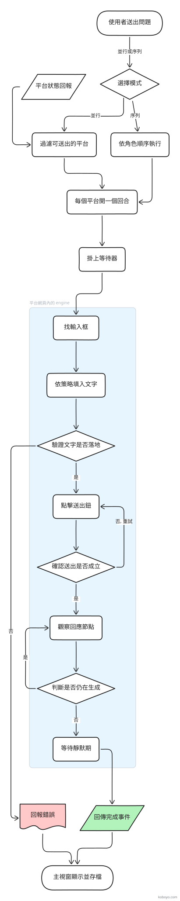

**English** | [繁體中文](./BASICS.zh-TW.md)

# BASICS — How this app works

How this app works. **Not a user manual, a description of the mechanism** — after reading it you
should be able to answer "what actually happens after I press send".

> Written against the source on 2026-08-20, baseline commit `5d5fb29`.
> It can go stale when the files it quotes change; every section names its file so you can check.
>
> The remaining files in `docs/` came from the source project and describe **its** product, which
> has already started to diverge from this branch.

## The core: no API key

The main window holds four child webviews that load the same ChatGPT / Claude / Gemini / Grok
sites you use every day. Sending calls no API. It **uses the browser session you are already
logged in with**: it types into the site's own input box, presses the site's own send button,
and reads the answer back. So the account, the quota and the model version are all yours, and
there is no key to keep safe.

The price is that **a provider redesign breaks it**. What breaks is usually the adapter (below).

## Three layers

| Layer | Location | Responsible for |
|---|---|---|
| Host | `src-tauri/` (Rust) | Creating, placing and hiding webviews, keeping each provider's login profile separate |
| Injected engine | `injected/engine.ts` | Runs inside the provider page: find the input box, type, send, decide when the answer is finished |
| Control pane | `src/` (React) | The interface, the mode flows, the conversation and the records |

The control pane cannot touch a provider page directly. It goes through the bridge: Rust pushes a
command into the page with `eval`, the page puts the result in an outbox for the control pane to
pull (`injected/bootstrap.ts` + `src-tauri/src/bridge.rs`). The implementation is the contract —
why `document.title` has to be the return channel is written in the file header comment of
`injected/codec.ts`.

## Adapters: one selector map per site

`adapters/*.json` defines, for each provider: the input-box selector, the send button, the
response block, how to tell that generation is running, and the sign-in / sign-out detectors.

> **These files are frozen by policy.** The seed table lives in the `expected` object of
> `scripts/check-adapters.mjs`, and `pnpm check-adapters` deep-compares it against the JSON field
> by field. To change how a provider is detected, change `injected/engine.ts`, not the JSON —
> editing the JSON directly is rejected at the verification step.

## Connection state

`src/ui/providerChipState.ts` decides in a fixed order; the first match wins:

| Order | State | Meaning |
|---|---|---|
| 1 | Opening… | The webview is being created |
| 2 | Open | There is no webview yet (this is the word on the card) |
| 3 | Needs repair | The adapter's selectors do not match the page |
| 4 | Connection problem | The bridge is degraded |
| 5 | Please sign in | A sign-out was detected, or a challenge page is in the way |
| 6 | Thinking | An answer is being generated |
| 7 | State stale | Loaded, but the send conditions are not met yet |
| 8 | Ready | Can send |

Whether it can send is decided by one line in `src/workflow/sendability.ts`:
`webview === 'loaded' && dom === 'ready' && login === 'logged_in'`.

> The `notes:` comment in that file records a known asymmetry: ChatGPT / Grok / Gemini will in
> fact **answer without a login**, and only Claude truly requires one. But "never signed in" and
> "session expired" are indistinguishable in the DOM, so the login condition stays. Today only
> Gemini can send while signed out, and that is an accident of it having no sign-out detector,
> not a design.

### Grok's four gates

All four are outside the app's field of view, so a first-time Grok user cannot know about them.
When a signed-out Grok is centred, a note on screen covers points 1, 3 and 4
(`provider.grokSignInNotes`) — it appears **before** the login because points 3 and 4 only fire
after the login, by which time there is no screen left to say it on. Point 2 is only written here,
because it is X's own screen and only reaches people who choose to sign in with X.

1. **Which sign-in methods work is decided by your x.ai account page.** The sign-in page
   (`accounts.x.ai/sign-in`, observed 2026-08-31) **always lists all four buttons** — Google, X,
   Apple, email. A button being there does not mean it works: only the methods you have enabled
   (connected) under "Sign-in methods" at `accounts.x.ai/account` reach your existing account.
   Everyone enables a different set, so "Google will not let me in" is not a bug in this app.
2. **Signing in with X adds one more authorisation page from X.** Observed 2026-08-31: the screen
   is titled `xAI Single Sign-On wants to access permissions on your account`, and you must press
   `Authorize app` to get back to Grok. That is X's OAuth screen, not Grok's, and first-time users
   easily think they took a wrong turn. The Google path instead opens Google's own sign-in window
   (`Continue to "X"`).
3. **After signing up or signing in, Grok asks once for your birth year inside the conversation.**
   It is not a popup and not a challenge page, just a message. The app cannot tell —
   `chat-input` and `chat-submit` are both present, so the card still says "Ready", but what comes
   back for your question is that age request, and a serial mode will pass it downstream as
   material. Centre Grok, switch to the **live page** and answer it. A new profile or a fresh
   sign-in means answering it again.
4. **Right after a first sign-up, the card can sit at "Opening…" forever.** Press "Go to sign-in"
   at the top, or close and reopen the app, and it usually turns ready.
   **"Opening…" means "this page has never reported whether anyone is signed in", not "not signed
   in yet"** (`providerChipState.ts`: this is the `login === 'unknown'` cell). So the screen cannot
   tell you whether Grok is signed in — pressing it may turn ready immediately (it was signed in
   all along and the signal never arrived), or it may turn out to really be signed out and need
   another round. That "do not know" is what the user actually experiences; do not write the note
   as though it will certainly work.
   The real cause is a title-signal race (`carry_grok_app_title_signal()` in `webviews.rs`): the
   injected engine uses `document.title` as its return channel, and if the title happens to sit at
   `Grok` during navigation and the new document has the same title,
   `on_document_title_changed` never fires and that epoch never gets its grant. **Control-side**
   commands such as "Go to sign-in" and `provider_reload` carry the previous round's signal into
   the new epoch; the automatic path does not.

## Placement and the stage

Each provider has three presentations (`src/ui/presentation.ts`):

- `chip` — collapsed, webview closed, costing nothing
- `side` — loaded but hidden off-screen
- `center` — up on the central stage

The central stage has two surfaces: the **live page** (the native webview) or the **text view**
(only the text that was scraped back). Centring a provider that is **not signed in** switches to
the live page and enlarges automatically — signing in can only be done on the live page, and a
sign-in form needs the room.
A signed-in provider goes back to **whichever surface it was last given** (the "Live page" / "Text"
buttons are written to `centerSurface` in `settings.json`) and survives a restart.
The stage's enlargement is for signing in, not a preference: **the size follows the login state** —
enlarged while signed out, restored as soon as a sign-in is reported, whether that is the first
report at startup or a login you just completed on screen. It is **not written to settings**, so
after a restart, clicking a signed-in provider is not enlarged. The surface behaves the opposite
way: it is decided once per centring, so that a fresh login is not swapped out for an empty text
view.

> The decision is `centerStageDecision()` (`src/ui/presentation.ts`). While login is still
> `unknown` it returns `undefined` = do nothing yet — at startup every provider is `unknown`, and
> deciding then would treat a signed-in account as signed out and enlarge it.

## Six modes

They differ only in who speaks, how many rounds, and in what order (`shared/constants.ts` +
`src/workflow/graph/`):

| Mode | Shape | Execution |
|---|---|---|
| Free | Sent to all four at once, each answers independently | Parallel |
| Multi-party consultation | Two sources answer → review adds → research summary | Serial |
| Four-way dialectic | For → against → judge → summary | Serial |
| Coding | Plan → review → implement → test → acceptance (8 steps) | Serial |
| Reasoned dialectic | 5 dialectic-spiral rounds × 4 seats | Serial |
| Brainstorm | 12 rounds · 48 turns · 5 stages | Serial |

Later steps of a serial mode **receive the earlier answers as material**. That is the fundamental
difference from free mode.

## The path a send takes

<picture>
  <source media="(prefers-color-scheme: dark)" srcset="./images/send-flow-dark.svg">
  
</picture>

The diagram is the same path plus the in-page engine detail (filling text, verification, send
retries, completion detection). The list below is how the control-pane side is split across files.

```
preflight.ts      Check who can send; block the ones that cannot and say why
      ↓
graph/executor.ts Advance step by step through the mode's graph
      ↓
stepRunner.ts     Per step: build the prompt → assign it to a provider
      ↓
sendAndWait.ts    Through the bridge, type into the page and press send
      ↓
waitForResponse.ts Wait for generation to end (thinkingDetectors + a timeout watchdog)
      ↓
providerResponse.ts Take the text back, hand it to the next step or into the transcript
```

## After a send

- **Transcript**: the answer goes into the conversation column on the right.
- **Snapshot**: keeps the question, the role assignment, and each step's input and output
  (`src/workflow/snapshot/`).
- **Replay**: **runs the same path again**. The AI answers afresh; it is not a playback of the old
  screen. Five checks come first: no snapshot, the graph was deleted, the graph version differs,
  the original question was not kept, preflight failed — when it blocks, it says which one.
- **Export**: Markdown, or the custom script you named in settings.

## Easy things to get wrong

- **"Replay" is not a playback.** It really asks again, and it produces a new snapshot.
- **"Ready" is about whether it can send, not about whether an account is attached.** See the
  asymmetry above.
- **Snapshots are not persisted by default.** Turn it on in settings, and only the `full-local`
  level keeps the original text.
- **The conversation column collapses itself.** When there are no messages and no provider can
  send, the right column gives its width to the settings area; a message or a ready AI brings it
  back.
